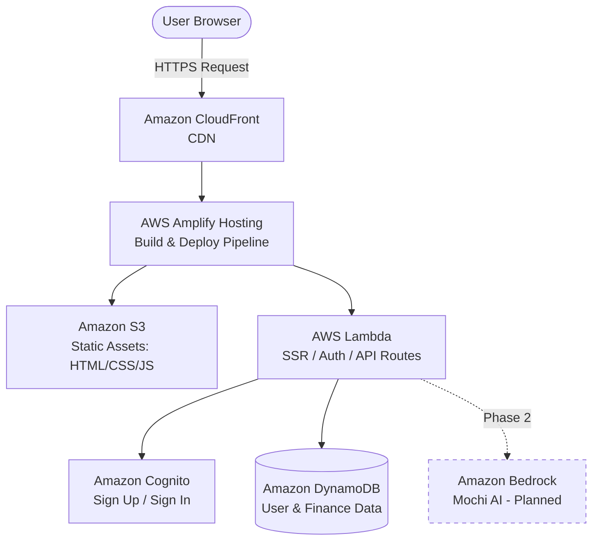

# Mochi — Deployment Architecture

**Live URL:** _[add your Amplify app URL here]_

## Overview

Mochi is an AI-powered budget tracker deployed on AWS using a fully managed, serverless architecture. The app is hosted and deployed through **AWS Amplify**, with **DynamoDB** for data storage and **Amazon Bedrock** planned for AI-driven financial insights.

## Architecture Diagram

## Request Flow

1. **User** visits the app URL in their browser.
2. **Amazon CloudFront** serves as the CDN, caching and delivering content from the nearest edge location for low latency.
3. **AWS Amplify Hosting** manages the CI/CD pipeline — every push to the connected Git branch triggers an automatic build and deploy.
4. **Static assets** (landing page, dashboard UI, sidebar) are served from **Amazon S3** via Amplify's hosting layer.
5. **Dynamic operations** — authentication checks, API calls, and any server-rendered pages — are handled by **AWS Lambda** functions provisioned automatically by Amplify.
6. **Sign up / sign in** is handled through **Amazon Cognito**, integrated via Amplify Auth.
7. **Amazon DynamoDB** stores user profiles and finance data (e.g. finance card entries), accessed through Amplify's data layer.
8. **Amazon Bedrock** *(planned)* will power the "Mochi AI" feature — generating summaries and insights from the user's finance data. This is not yet wired into the live app.

## Why This Stack

- **AWS Amplify** was chosen over manually configuring EC2/S3/CloudFront because it bundles hosting, CI/CD, auth, and API/data layers into a single managed workflow — ideal for a small team shipping fast during a cohort timeline, without sacrificing access to the underlying AWS services (S3, Lambda, CloudFront) when more control is needed later.
- **DynamoDB** was chosen over a relational database (e.g. RDS) because Mochi's data — user profiles, transactions, finance cards — is naturally key-based and doesn't require complex joins. DynamoDB's serverless, pay-per-request model also scales automatically without capacity planning, which fits an app with unpredictable, early-stage traffic.
- **Amazon Bedrock** is planned over a third-party LLM API to keep the AI layer inside the AWS ecosystem — meaning Mochi AI can call DynamoDB-stored data directly through IAM roles rather than managing separate API keys/secrets for an external provider, and it keeps latency and billing consolidated within AWS.

## Current Status

| Component | Status |
|---|---|
| Landing page | ✅ Live |
| Sign up / Sign in (Cognito) | ✅ Live |
| Dashboard + sidebar | ✅ Live |
| Finance card | ✅ Live |
| Summaries card | 🔲 In progress |
| Savings goals | 🔲 In progress |
| Mochi AI (Bedrock) | 🔲 Planned — not yet wired |
| Settings | 🔲 In progress |
| FAQs / Help center | 🔲 In progress |

## Next Steps

- Confirm whether the frontend is served via SSR (Lambda) or as a static SPA (S3 + CloudFront only), and update the diagram's Lambda box accordingly.
- Wire Amazon Bedrock into the Mochi AI sidebar feature.
- Add CloudWatch logging for Lambda functions (auth, API routes) for basic observability.